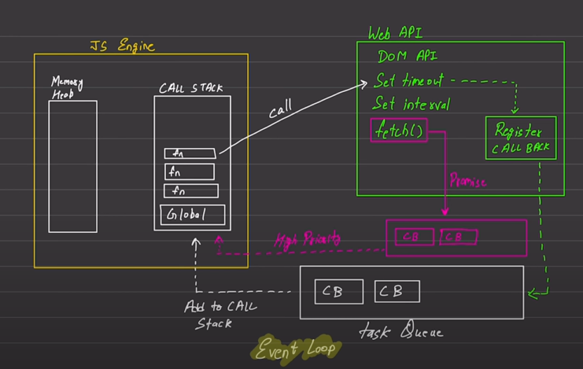

## Async JavaScript Fundamentals

### Javascript
* Synchronous
* Single Threaded

### Execution Context
* Execute one line of code at a time
    1. console.log(1) -> Executed first
    2. console.log(2) -> Executed after first statement 

    Call Stack + Memory Heap

### Blocking Code vs Non - Blocking Code
| Blocking | Non-Blocking |
| ---- | ---- |
| Blocks the execution | Doesn't block the execution | 
| Read file sync | Read file async |

